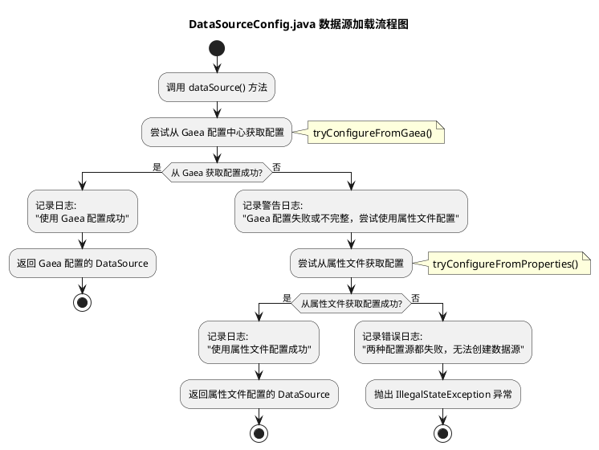
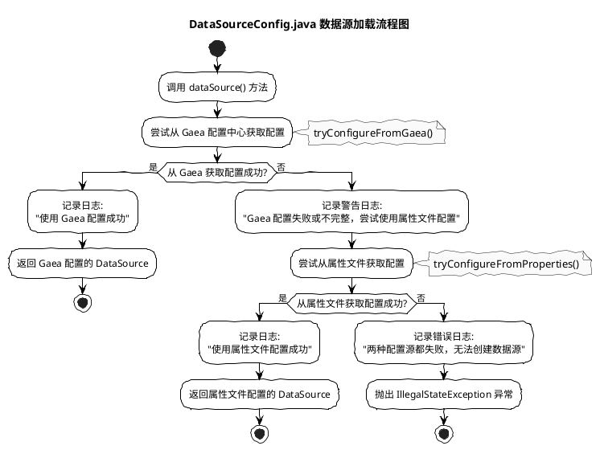
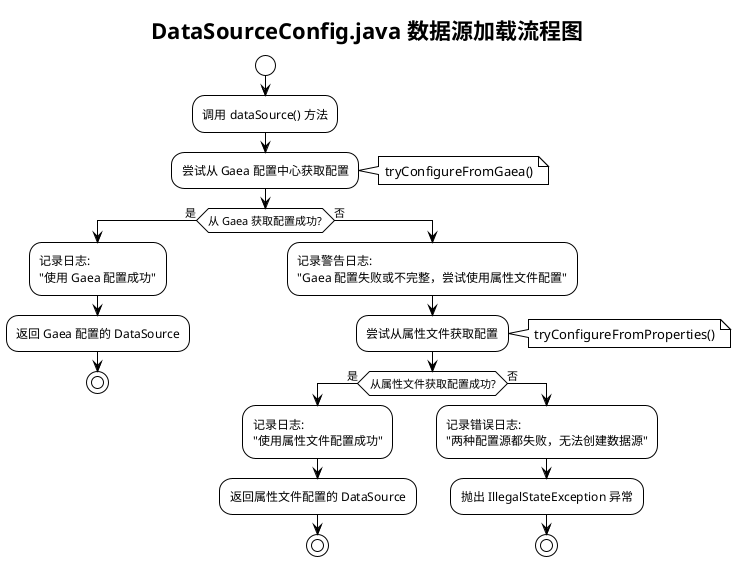
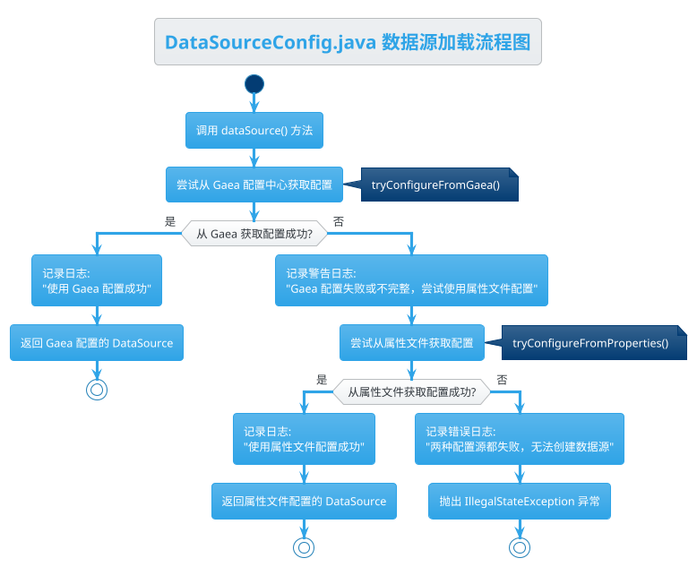
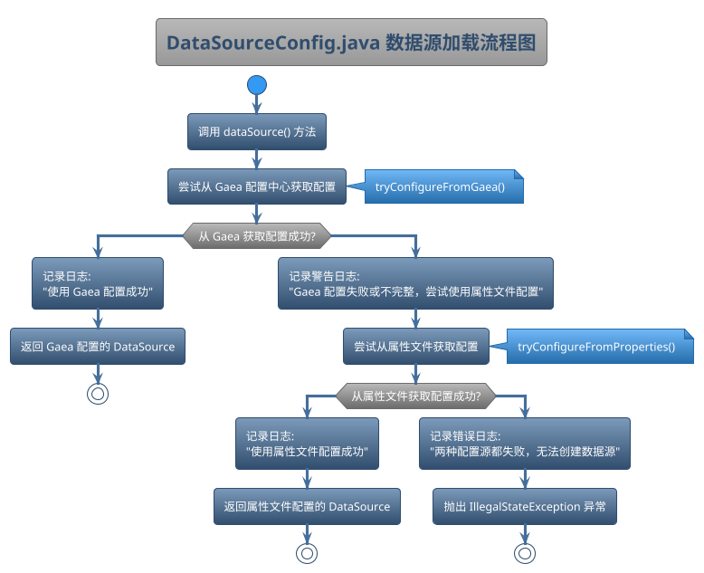
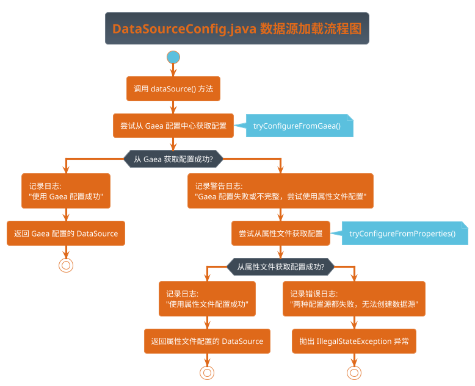
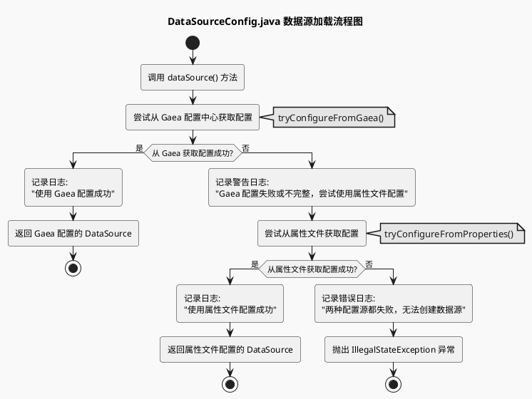
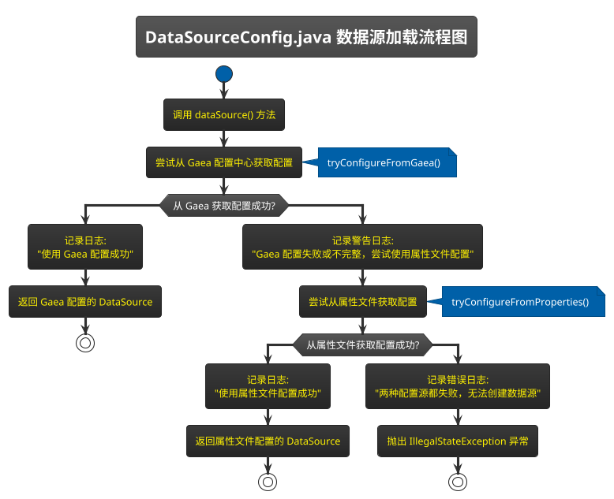
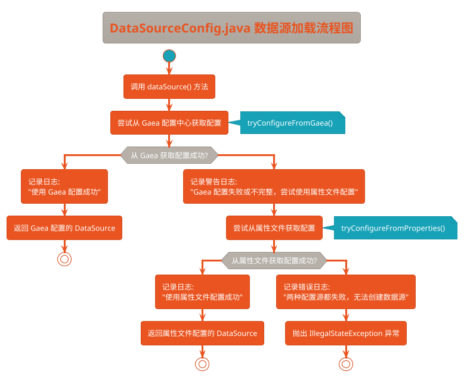
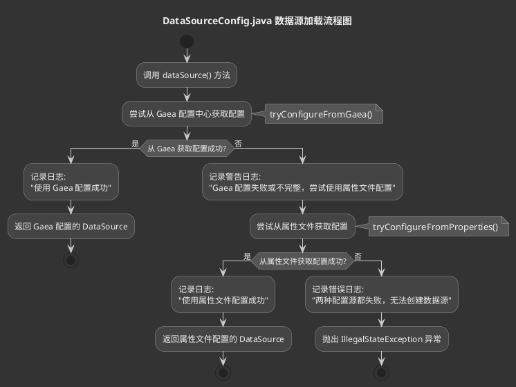

# PlantUML流程图主题风格指南

## 背景

在文档中描述流程时，如果仅用文字描述，往往显得杂乱无章，难以达到一图胜万言的效果。PlantUML作为一种强大的图形绘制工具，能够通过简单的文本语法生成优美的流程图、类图、时序图等，大大提高了技术文档的表现力和可读性。

## 选用大模型提示词

- **大模型**：优先Claude3.7，Gemini生成一般
- **提示词**：
  1. 使用PlantUML生成流程图
  2. 使用风格sketchy
  3. 使用最标准的UML语法，尽量适应所有的解析器
  4. 生成到项目根目录下，文件名根据内容自行定义

## 常见主题及举例


PlantUML提供了丰富的主题选择，可以满足不同场景和个人偏好的需求。以下是一些常见的主题及其特点：

### 1. 默认主题 (Default)

默认主题使用蓝色调为主，简洁明了，适合大多数场景下的图表展示。没有特殊的视觉效果，专注于内容本身。



### 2. 手绘风格 (Sketchy)

手绘风格模拟手工绘制的效果，给人一种草图设计的感觉。适合早期概念设计和头脑风暴会议上的展示，增加亲和力。



### 3. 简约主题 (Plain)

Plain主题极简风格，去除了多余的装饰和颜色，使图表看起来更加清晰和专业。适合正式文档和需要打印的报告。



### 4. 极简主题 (Minimal)

Minimal主题进一步简化了图表元素，采用极简设计理念，线条细腻，色彩柔和。非常适合现代化的应用文档和演示。

```plantuml
@startuml DataSourceConfig流程图-Minimal主题

!theme minimal
title "DataSourceConfig.java 数据源加载流程图"

start
:调用 dataSource() 方法;

:尝试从 Gaea 配置中心获取配置;
note right: tryConfigureFromGaea()

if (从 Gaea 获取配置成功?) then (是)
  :记录日志: 
  "使用 Gaea 配置成功";
  :返回 Gaea 配置的 DataSource;
  stop
else (否)
  :记录警告日志: 
  "Gaea 配置失败或不完整，尝试使用属性文件配置";
  
  :尝试从属性文件获取配置;
  note right: tryConfigureFromProperties()
  
  if (从属性文件获取配置成功?) then (是)
    :记录日志: 
    "使用属性文件配置成功";
    :返回属性文件配置的 DataSource;
    stop
  else (否)
    :记录错误日志: 
    "两种配置源都失败，无法创建数据源";
    :抛出 IllegalStateException 异常;
    stop
  endif
endif

@enduml
```

### 5. 湖蓝主题 (Cerulean)

Cerulean主题以湖蓝色为基调，给人清新、专业的感觉。适合与水、环境或科技相关的业务领域。



### 6. 太空实验室主题 (Spacelab)

Spacelab主题采用中性色调，设计简洁大方，给人一种科学实验室的感觉。适合数据分析和科学研究相关的文档。



### 7. 超级英雄主题 (Superhero)

Superhero主题色彩鲜明，对比度高，给人一种强烈的视觉冲击。适合演示文稿和需要吸引注意力的场合。



### 8. 火星主题 (Mars)

Mars主题以红色为主调，界面设计简洁大方，带有一定的科幻感。适合与太空、探索相关的领域。



### 9. 黑骑士主题 (Black-Knight)

Black-Knight主题采用深色系设计，视觉冲击力强，适合夜间模式或需要强调重要内容的场景。



### 10. 团结主题 (United)

United主题采用温暖的红色调，给人一种积极向上的感觉。适合团队合作、项目管理类文档。



### 11. 自定义深色主题 (CustomDark)

当标准的dark主题不可用时，可以使用自定义深色主题，通过明确设置各种元素的颜色来实现深色效果。适合夜间阅读和低光环境。



## 其他主题及格式

除了PlantUML格式，还有Mermaid格式，但是支持的图形类型和样式不如PlantUML多。

生成文件格式为：xxx.puml，IDEA插件为：PlantUML Integration

## 主题及展示

更多主题请参考官方文档：[https://plantuml.com/zh/theme](https://plantuml.com/zh/theme) 